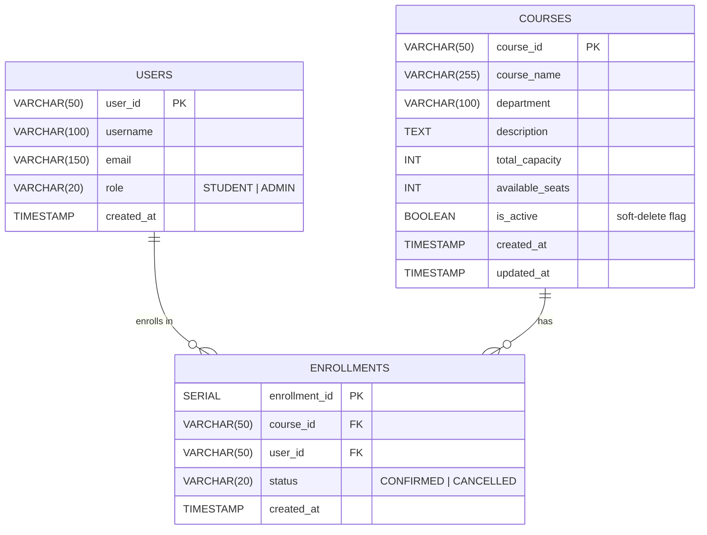
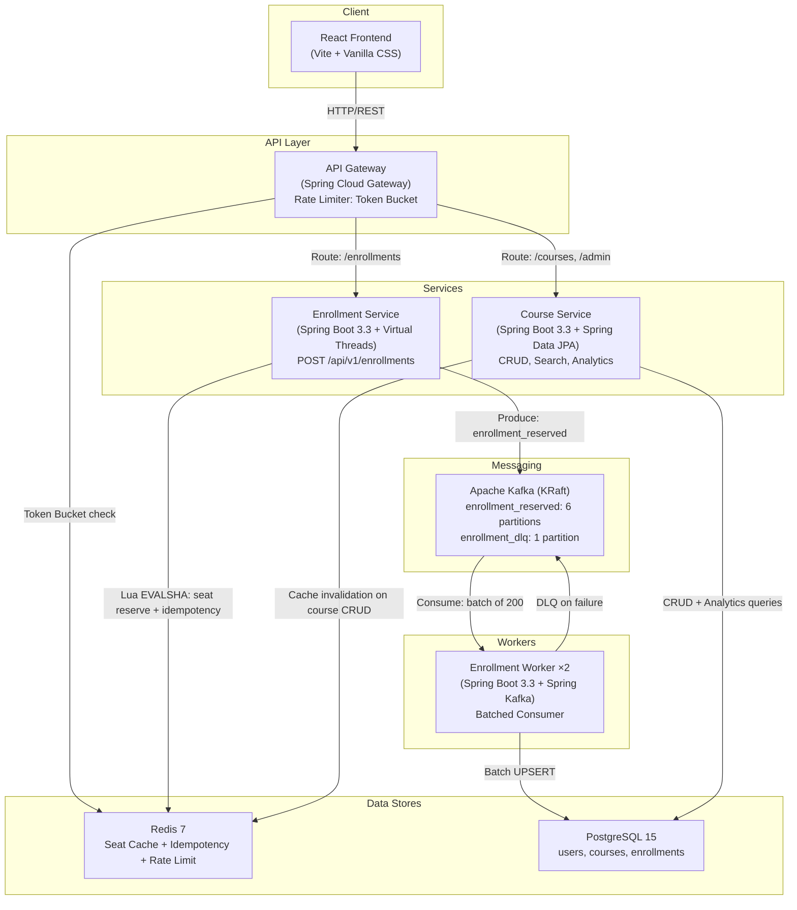

# University ERP — Distributed Enrollment Engine

## System Design Document

> **Version**: 1.0  
> **Last Updated**: 2026-06-12  
> **Status**: Approved for implementation

---

## 1. Requirements

### 1.1 Functional Requirements

#### Admin Flow
| ID | Requirement | Priority |
|----|-------------|----------|
| FR-A1 | Admin can add new courses to the system | High |
| FR-A2 | Admin can remove (soft-delete) courses from the system | High |
| FR-A3 | Admin can view cumulative enrollment across all courses | High |
| FR-A4 | Admin can view per-course enrollment analytics (charts, breakdowns) | High |
| FR-A5 | Admin can add new users to the system | Medium |
| FR-A6 | Admin can remove users from the system | Medium |
| FR-A7 | Admin can view and manage the Dead Letter Queue (DLQ) | Medium |

#### User Flow
| ID | Requirement | Priority |
|----|-------------|----------|
| FR-U1 | Users can search courses via substring matching | High |
| FR-U2 | Users can enroll in available courses | High |
| FR-U3 | System rejects duplicate enrollment requests (API idempotency) | High |
| FR-U4 | System rate-limits user requests (Token Bucket algorithm) | High |
| FR-U5 | Users can view their current enrollments | Medium |

### 1.2 Non-Functional Requirements

| ID | Requirement | Target | Rationale |
|----|-------------|--------|-----------|
| NFR-1 | Enrollment throughput | **10,000 RPS** sustained | Flash-sale enrollment pattern — thousands of students enrolling at course-open time |
| NFR-2 | Zero overbooking guarantee | **Exactly N** enrollments for N-capacity course | Atomic Redis Lua script ensures no race conditions |
| NFR-3 | API idempotency | **100%** duplicate rejection | Redis `SETNX` with 24h TTL — prevents double-submissions from panic clicks |
| NFR-4 | Write decoupling | Kafka message broker | Large write throughput decoupled from Postgres via batched async consumption |
| NFR-5 | Fault tolerance | DLQ for failed writes | Non-transient failures routed to `enrollment_dlq` with enriched metadata |
| NFR-6 | Containerization | Docker Compose | All services containerized for horizontal scalability |
| NFR-7 | Architecture | Microservices | Services independently deployable and scalable |

### 1.3 Out of Scope (v1)

- OAuth2 / JWT authentication (using simple `X-User-Id` / `X-User-Role` headers via gateway)
- Email notifications on enrollment
- Waitlist / priority queue for full courses
- Course scheduling / timetable conflict detection
- Payment integration

---

## 2. Dataset

**Harvard Course Enrollment (Fall 2015)** — [Kaggle](https://www.kaggle.com/datasets/neelmehta/harvard-course-enrollment-fall-2015)

| Attribute | Details |
|-----------|---------|
| Format | CSV |
| Records | ~1,200 courses |
| Fields | Course ID, course name, department/category, enrollment count |
| Usage | Seed the `courses` table on first boot via a Spring Boot `CommandLineRunner` |
| Capacity Generation | Derive `total_capacity` from real enrollment counts (e.g., `enrollment_count * 1.2` rounded up) |

Synthetic `user_id`s will be generated at init time (e.g., 500 pre-seeded student users + 5 admin users).

---

## 3. Entities

### 3.1 Entity Relationship Diagram



### 3.2 Entity Details

#### `users`

| Column | Type | Constraints | Purpose |
|--------|------|-------------|---------|
| `user_id` | `VARCHAR(50)` | `PRIMARY KEY` | Unique identifier (UUID or readable ID like `STU-00001`) |
| `username` | `VARCHAR(100)` | `NOT NULL` | Display name |
| `email` | `VARCHAR(150)` | `UNIQUE, NOT NULL` | Contact / login identifier |
| `role` | `VARCHAR(20)` | `NOT NULL, DEFAULT 'STUDENT'` | `STUDENT` or `ADMIN` — determines access level |
| `created_at` | `TIMESTAMP` | `DEFAULT CURRENT_TIMESTAMP` | Audit trail |

> **Purpose**: Represents all system actors. Admin users manage courses and users. Student users search and enroll. No dedicated auth system — the API gateway identifies users via `X-User-Id` header and resolves role from this table.

#### `courses`

| Column | Type | Constraints | Purpose |
|--------|------|-------------|---------|
| `course_id` | `VARCHAR(50)` | `PRIMARY KEY` | Unique identifier (e.g., `COMPSCI-50`, `ECON-10A`) |
| `course_name` | `VARCHAR(255)` | `NOT NULL` | Full course title for display and search |
| `department` | `VARCHAR(100)` | | Department grouping for analytics |
| `description` | `TEXT` | | Course description (optional) |
| `total_capacity` | `INT` | `NOT NULL` | Maximum enrollments allowed |
| `available_seats` | `INT` | `NOT NULL` | Current remaining seats (source of truth in Postgres; Redis is the hot-path cache) |
| `is_active` | `BOOLEAN` | `DEFAULT TRUE` | Soft-delete flag — inactive courses hidden from search |
| `created_at` | `TIMESTAMP` | `DEFAULT CURRENT_TIMESTAMP` | Audit trail |
| `updated_at` | `TIMESTAMP` | `DEFAULT CURRENT_TIMESTAMP` | Last modification timestamp |

> **Purpose**: The course catalog. `available_seats` in Postgres is the durable source of truth, reconciled periodically from enrollment counts. The Redis key `course:{id}:seats` is the real-time hot-path cache used by the Lua script during flash-sale traffic. When an admin adds/removes a course, course-service updates both Postgres and Redis.

#### `enrollments`

| Column | Type | Constraints | Purpose |
|--------|------|-------------|---------|
| `enrollment_id` | `SERIAL` | `PRIMARY KEY` | Auto-incrementing surrogate key |
| `course_id` | `VARCHAR(50)` | `FK → courses(course_id)` | Enrolled course reference |
| `user_id` | `VARCHAR(50)` | `FK → users(user_id)` | Enrolling student reference |
| `status` | `VARCHAR(20)` | `DEFAULT 'CONFIRMED'` | Enrollment state |
| `created_at` | `TIMESTAMP` | `DEFAULT CURRENT_TIMESTAMP` | When enrollment was persisted |
| | | `UNIQUE(course_id, user_id)` | **Prevents duplicate enrollments at DB level** — last line of defense after Redis idempotency check |

> **Purpose**: The enrollment fact table. Written asynchronously by the enrollment-worker via batched Kafka consumption. The `UNIQUE(course_id, user_id)` constraint is critical — it's the database-level idempotency guarantee that makes `INSERT ... ON CONFLICT DO NOTHING` safe even if Redis state is lost.

### 3.3 Indexes

```sql
-- Substring search (simple B-tree, sufficient for <10K courses)
CREATE INDEX idx_courses_name ON courses(course_name);

-- Analytics: enrollment count per course
CREATE INDEX idx_enrollments_course_id ON enrollments(course_id);

-- Analytics: time-series enrollment trends
CREATE INDEX idx_enrollments_created_at ON enrollments(created_at);

-- User lookup (gateway resolves role from user_id)
CREATE INDEX idx_users_email ON users(email);
```

> **Note**: For substring search, `ILIKE '%query%'` cannot use a B-tree index (it requires a leading wildcard). At <10K courses, a sequential scan completes in <5ms — acceptable. If courses grow to 100K+, upgrade to `pg_trgm` with a GIN index:
> ```sql
> CREATE EXTENSION pg_trgm;
> CREATE INDEX idx_course_name_trgm ON courses USING GIN (course_name gin_trgm_ops);
> ```

---

## 4. API Endpoints

### 4.1 Gateway Routes

All requests enter through the API Gateway at `http://localhost:8080`. The gateway handles:
- **Rate Limiting** (Token Bucket via Redis, per user)
- **Routing** to downstream services
- **CORS** for frontend origin
- **Role Extraction** from `X-User-Id` header (resolves role, injects `X-User-Role`)

### 4.2 Enrollment Service Endpoints

| Method | Path | Description | Auth | Rate Limited | Response |
|--------|------|-------------|------|--------------|----------|
| `POST` | `/api/v1/enrollments` | Enroll user in a course | Student | ✅ Yes | `202 Accepted` or `409 Conflict` or `400 Bad Request` |

**Request:**
```json
POST /api/v1/enrollments
Headers:
  X-User-Id: STU-00042
  Idempotency-Key: 550e8400-e29b-41d4-a716-446655440000
  Content-Type: application/json

Body:
{
  "courseId": "COMPSCI-50"
}
```

**Response Scenarios:**
```json
// 202 — Enrollment accepted, queued for persistence
{ "message": "Enrollment accepted", "status": "PROCESSING" }

// 409 — Duplicate request (idempotency key already seen)
{ "error": "Conflict: Request already processed or in progress" }

// 400 — Course full
{ "error": "Course is full" }

// 400 — Already enrolled (Redis user set check)
{ "error": "User is already enrolled in this course" }

// 429 — Rate limited
{ "error": "Too many requests", "retryAfter": 2 }
```

### 4.3 Course Service Endpoints

#### Public Endpoints

| Method | Path | Description | Auth | Response |
|--------|------|-------------|------|----------|
| `GET` | `/api/v1/courses` | List all active courses (paginated) | Any | `200 OK` — Page of courses |
| `GET` | `/api/v1/courses/search?q={query}` | Substring search on `course_name` and `course_id` | Any | `200 OK` — Matching courses |
| `GET` | `/api/v1/courses/{courseId}` | Single course detail with enrollment count | Any | `200 OK` — Course detail |

**Search Example:**
```json
GET /api/v1/courses/search?q=comp&page=0&size=20

// 200
{
  "content": [
    {
      "courseId": "COMPSCI-50",
      "courseName": "Introduction to Computer Science",
      "department": "Computer Science",
      "totalCapacity": 600,
      "availableSeats": 342,
      "isActive": true
    },
    {
      "courseId": "COMPSCI-51",
      "courseName": "Abstraction and Design in Computation",
      "department": "Computer Science",
      "totalCapacity": 200,
      "availableSeats": 88,
      "isActive": true
    }
  ],
  "totalElements": 2,
  "page": 0,
  "size": 20
}
```

#### Admin Endpoints

| Method | Path | Description | Auth | Response |
|--------|------|-------------|------|----------|
| `POST` | `/api/v1/courses` | Add a new course | Admin | `201 Created` |
| `DELETE` | `/api/v1/courses/{courseId}` | Soft-delete a course | Admin | `204 No Content` |
| `GET` | `/api/v1/admin/analytics` | Cumulative enrollment analytics | Admin | `200 OK` — Analytics summary |
| `GET` | `/api/v1/admin/analytics/department` | Per-department enrollment breakdown | Admin | `200 OK` — Department stats |
| `GET` | `/api/v1/admin/analytics/timeseries?range=7d` | Time-series enrollment data | Admin | `200 OK` — Data points |
| `GET` | `/api/v1/admin/dlq` | View DLQ messages | Admin | `200 OK` — DLQ entries |
| `POST` | `/api/v1/admin/dlq/replay` | Replay DLQ messages back to main topic | Admin | `202 Accepted` |
| `POST` | `/api/v1/admin/users` | Add a new user | Admin | `201 Created` |
| `DELETE` | `/api/v1/admin/users/{userId}` | Remove a user | Admin | `204 No Content` |
| `GET` | `/api/v1/admin/users` | List all users (paginated) | Admin | `200 OK` — Page of users |

**Add Course Example:**
```json
POST /api/v1/courses
Headers:
  X-User-Id: ADMIN-001

Body:
{
  "courseId": "CS-NEW-101",
  "courseName": "Introduction to Machine Learning",
  "department": "Computer Science",
  "description": "Fundamentals of ML including supervised and unsupervised learning.",
  "totalCapacity": 150
}

// 201
{
  "courseId": "CS-NEW-101",
  "courseName": "Introduction to Machine Learning",
  "totalCapacity": 150,
  "availableSeats": 150,
  "isActive": true,
  "createdAt": "2026-06-12T12:00:00Z"
}
```

**Analytics Example:**
```json
GET /api/v1/admin/analytics

// 200
{
  "totalCourses": 1200,
  "activeCourses": 1180,
  "totalEnrollments": 45230,
  "totalCapacity": 180000,
  "utilizationPercent": 25.1,
  "topCourses": [
    { "courseId": "COMPSCI-50", "courseName": "Intro to CS", "enrollments": 598, "capacity": 600 },
    { "courseId": "ECON-10A", "courseName": "Principles of Economics", "enrollments": 480, "capacity": 500 }
  ],
  "departmentBreakdown": [
    { "department": "Computer Science", "enrollments": 12400, "courseCount": 85 },
    { "department": "Economics", "enrollments": 8900, "courseCount": 62 }
  ]
}
```

#### User Self-Service Endpoints

| Method | Path | Description | Auth | Response |
|--------|------|-------------|------|----------|
| `GET` | `/api/v1/users/{userId}/enrollments` | View user's enrollments | Owner | `200 OK` — List of enrolled courses |

---

## 5. High-Level Design

### 5.1 Architecture Overview



### 5.2 Microservice Decomposition

| Service | Responsibility | Why it's a separate service | Scale Profile |
|---------|---------------|---------------------------|---------------|
| **API Gateway** | Rate limiting (Token Bucket), routing, CORS, role injection | Centralized rate limiting prevents bypass — if users discover enrollment-service's direct URL they can't skip rate limits. Security concern, not just architecture. | 1 instance (dev), 2 (prod for HA) |
| **Enrollment Service** | Idempotency check → Redis Lua seat reservation → Kafka produce → 202 Accepted | This is the flash-sale hot path (10ms target latency). Must be isolated so that admin analytics GC pauses in course-service don't spike enrollment p99. At 10K RPS, a single GC pause = hundreds of dropped enrollment requests if sharing a JVM. | **1 instance handles 10K RPS** (see §5.3). 2 in prod for HA. |
| **Course Service** | Course CRUD, substring search, enrollment analytics, user management, DLQ viewer | Read-heavy with different SLA (100ms acceptable). Admin analytics queries run aggregate SQL that can cause GC pressure — must not share JVM with enrollment hot path. | 1 instance |
| **Enrollment Worker** | Kafka batch consumer → batched Postgres UPSERT → DLQ routing | Consumers scale with partition count (max consumers = partition count). Decoupled from API latency path — users already received 202. | 2-3 instances (≤ 6 partitions) |

### 5.3 Throughput Analysis

#### Enrollment Service (Single JVM — 10K RPS)

```
Request lifecycle (Java 21 Virtual Threads):
  1. Parse JSON body                    ~0.02ms CPU
  2. Redis SETNX (idempotency)          ~0.1ms  (I/O wait, virtual thread yields)
  3. Redis EVALSHA (Lua seat reserve)   ~0.1ms  (I/O wait, virtual thread yields)
  4. Kafka send (async, buffered)       ~0.01ms (adds to internal producer buffer)
  5. Return 202 Accepted               ~0.01ms
  ──────────────────────────────────────
  Wall-clock per request:               ~0.25ms
  Actual CPU time per request:          ~0.05ms
```

**CPU budget:**
```
10,000 requests/sec × 0.05ms CPU/request = 0.5 CPU-seconds/second
= 50% of 1 CPU core on a 4-core machine → 12.5% total CPU utilization
```

**Redis I/O budget:**
```
Connection pool: 8 connections
Round-trip time: ~0.1ms per Redis command
Max throughput:  8 connections / 0.0001 sec = 80,000 ops/sec
Required:        10,000 RPS × 2 Redis calls = 20,000 ops/sec
Headroom:        4× (80K capacity / 20K required)
```

**Kafka producer budget:**
```
Spring Kafka producer with linger.ms=5, batch.size=32KB
Internally batches messages and flushes every 5ms
At 10K RPS: 50 messages per 5ms batch → ~2,000 batched sends/sec
Single producer capacity: 100,000+ msgs/sec
Headroom:  10×
```

**Peak concurrency:**
```
10,000 RPS × 0.00025 sec/request = ~2.5 concurrent virtual threads (average)
Virtual thread capacity: millions
```

**Verdict**: A single Spring Boot instance with Java 21 Virtual Threads handles 10K RPS at **12.5% CPU utilization**. Horizontal scaling (2nd instance) is needed only for **high availability** (survive JVM crash) and **zero-downtime rolling deploys**. Throughput-based scaling begins at ~50K RPS.

#### Kafka Consumer (Batched Writes — Per Partition)

```
Consumer poll loop (per partition):
  1. Poll batch of 200 messages         ~2ms   (network fetch from broker)
  2. Deserialize 200 JSON payloads      ~0.5ms (Jackson)
  3. Batch UPSERT to Postgres           ~8-10ms
     INSERT INTO enrollments (course_id, user_id)
     VALUES ($1,$2), ($3,$4), ..., ($399,$400)
     ON CONFLICT (course_id, user_id) DO NOTHING
  4. Commit Kafka offset                ~1ms
  ──────────────────────────────────────
  Total per batch:                      ~12-14ms
  Throughput per partition:             200 msgs / 14ms ≈ 14,000 msgs/sec
```

**Partition count justification:**
```
Target:           10,000 msgs/sec sustained
Per partition:    ~14,000 msgs/sec with batching
Minimum needed:   1 partition (14K > 10K)
Recommended:      6 partitions

Why 6?
  - 2× headroom over minimum (handles 84K msgs/sec total)
  - Fault tolerance: 4 of 6 consumers can die and remaining 2 still handle 28K msgs/sec (>10K)
  - Partition key is course_id — 6 partitions distributes ~1,200 courses evenly (~200 courses/partition)
  - Rebalancing impact: fewer partitions = faster consumer group rebalance
```

**Why not 3 (current)?** 3 works mathematically (42K capacity > 10K needed), but fault tolerance drops — losing 2 of 3 consumers leaves 1 consumer handling all 10K. Acceptable but tight.

**Why not 12?** Diminishing returns. 12 partitions means 12 consumers max, but we only need 2-3 consumers for 10K RPS. Extra partitions increase rebalance time, Kafka metadata overhead, and each partition maintains its own log segment on disk. Wasteful at our scale.

#### Postgres Write Budget

```
With batched consumer at 10K msgs/sec:
  Batch size: 200 messages
  Batches per second: 10,000 / 200 = 50 batch INSERTs/sec
  
  Postgres capacity: 5,000-10,000 simple INSERTs/sec (single node)
  Our load:          50 batch operations/sec
  Headroom:          100-200×

  Without batching (for comparison):
  Load:              10,000 individual INSERTs/sec
  Headroom:          0.5-1× (at or over capacity — dangerous)
```

**Batching is the single largest architectural win.** It transforms Postgres from a bottleneck to a non-issue.

### 5.4 Inter-Service Communication

| From → To | Method | Why |
|-----------|--------|-----|
| Frontend → Gateway | HTTP/REST | Standard web client communication |
| Gateway → Enrollment Service | HTTP/REST | Simple request-response. gRPC saves ~0.5ms per hop but Kafka linger (5ms) dwarfs the delta. REST is debuggable with curl. |
| Gateway → Course Service | HTTP/REST | Same rationale — no streaming, no polyglot, debuggability wins. |
| Enrollment Service → Worker | **Kafka (async)** | Critical decoupling. Users get 202 immediately; Postgres writes happen asynchronously. |
| Worker → Postgres | JDBC (direct) | Worker writes directly to the shared DB. No API call needed — same DB, same schema. |
| Course Service → Redis | Direct (Lettuce client) | When admin adds/removes a course, course-service updates Redis seat cache to keep Lua script accurate. |

**On gRPC**: Not adopted for v1. Rationale:
- No service-to-service streaming requirement
- No polyglot services (all Java)
- Hot-path latency is dominated by Redis (0.1ms) and Kafka linger (5ms), not serialization overhead
- gRPC adds complexity: protobuf schema management, HTTP/2 load balancer configuration, harder debugging
- If future services are added in Python/Go, gRPC becomes valuable for schema contract enforcement

---

## 6. Rate Limiting

### 6.1 Algorithm: Token Bucket

| Property | Value |
|----------|-------|
| Algorithm | Token Bucket |
| Rate (`r`) | 5 tokens/second per user |
| Burst (`b`) | 10 tokens per user |
| Storage | Redis (per-user key) |
| Implementation | Single Lua script via `EVALSHA` |
| Scope | Per `X-User-Id`, applied at API Gateway |

### 6.2 Why Token Bucket?

Enrollment traffic is **inherently bursty** — thousands of students hit "enroll" simultaneously when courses open. The algorithm must:
1. **Allow the initial burst** (student's first few clicks should succeed instantly)
2. **Smoothly throttle** sustained abuse (bots, panic-clickers)

| Algorithm | Burst Handling | Why not for us |
|-----------|---------------|----------------|
| **Token Bucket** ✅ | Excellent — burst up to `b`, then throttle | **Selected** |
| Leaky Bucket | Poor — queues ALL traffic, smooths burst | Delays legitimate first-clicks during flash-sale, degrading UX |
| Fixed Window Counter | Edge-spike: 2× burst at window boundary | A user could send 10 requests at 0:59 and 10 more at 1:00 |
| Sliding Window Log | Accurate but O(n) memory per user | At 50K users × 10 entries = 500K entries in Redis — wasteful |
| Sliding Window Counter | Good (99.7% accurate) | Strong runner-up, but Token Bucket's explicit `burst` parameter gives finer control |

### 6.3 Token Bucket Lua Script

```lua
-- KEYS[1] = rate_limit:{user_id}
-- ARGV[1] = rate (tokens per second)
-- ARGV[2] = burst (max tokens)
-- ARGV[3] = now (current timestamp in microseconds)
-- ARGV[4] = requested tokens (usually 1)

local key = KEYS[1]
local rate = tonumber(ARGV[1])
local burst = tonumber(ARGV[2])
local now = tonumber(ARGV[3])
local requested = tonumber(ARGV[4])

local data = redis.call("HMGET", key, "tokens", "last_refill")
local tokens = tonumber(data[1])
local last_refill = tonumber(data[2])

if tokens == nil then
    -- First request from this user — initialize bucket
    tokens = burst
    last_refill = now
end

-- Refill tokens based on elapsed time
local elapsed = (now - last_refill) / 1000000  -- convert μs to seconds
local new_tokens = math.min(burst, tokens + (elapsed * rate))

if new_tokens < requested then
    -- Not enough tokens — reject
    redis.call("HMSET", key, "tokens", new_tokens, "last_refill", now)
    redis.call("EXPIRE", key, 60)  -- TTL for cleanup
    return 0  -- REJECTED
end

-- Consume tokens — allow
new_tokens = new_tokens - requested
redis.call("HMSET", key, "tokens", new_tokens, "last_refill", now)
redis.call("EXPIRE", key, 60)
return 1  -- ALLOWED
```

### 6.4 Memory Budget

```
Per user: 1 Redis hash with 2 fields (tokens, last_refill) ≈ 100 bytes with overhead
At 50,000 concurrent users: 50,000 × 100 bytes = 5 MB
With 60-second TTL: inactive users auto-evict
```

---

## 7. Dead Letter Queue (DLQ) Strategy

### 7.1 Flow Diagram

```
enrollment_reserved (6 partitions, key = course_id)
         │
         ▼
  ┌──────────────┐
  │  Enrollment   │  Batch consumer: poll 200 messages
  │   Worker      │  Batch UPSERT to Postgres
  └──────┬───────┘
         │
         ├─── SUCCESS (normal path)
         │      → Commit Kafka offset
         │
         ├─── TRANSIENT ERROR (Postgres connection timeout, 08*/53* codes)
         │      → Retry with exponential backoff (Spring Retry)
         │        Attempt 1: wait 1s
         │        Attempt 2: wait 2s
         │        Attempt 3: wait 4s
         │      → If all 3 attempts fail → route to DLQ
         │
         ├─── NON-TRANSIENT ERROR (FK violation, constraint error, data corruption)
         │      → Immediately route to DLQ (retrying won't fix bad data)
         │
         └─── PARTIAL BATCH FAILURE (195 of 200 succeed, 5 fail)
                → Execute batch UPSERT
                → On exception: fall back to individual UPSERTs for entire batch
                → Identify which records failed
                → DLQ only the failing records (not all 200)
                → Commit offset for entire batch
```

### 7.2 DLQ Message Schema

```json
{
  "originalPayload": {
    "userId": "STU-00042",
    "courseId": "COMPSCI-50",
    "timestamp": "2026-06-12T12:00:00Z"
  },
  "error": {
    "message": "violates foreign key constraint \"enrollments_course_id_fkey\"",
    "code": "23503",
    "type": "NON_TRANSIENT"
  },
  "metadata": {
    "retryCount": 0,
    "failedAt": "2026-06-12T12:00:01Z",
    "sourcePartition": 3,
    "sourceOffset": 154829,
    "workerInstanceId": "worker-2"
  }
}
```

### 7.3 DLQ Topic Configuration

| Property | Value | Rationale |
|----------|-------|-----------|
| Topic name | `enrollment_dlq` | Convention: `{original_topic}_dlq` |
| Partitions | 1 | DLQ traffic is minimal — only error cases |
| Retention | 7 days | Gives ops team time to investigate and replay |
| Compaction | Disabled | Every error message matters for audit |

### 7.4 DLQ Admin Operations

Exposed via course-service admin endpoints:

- **View**: `GET /api/v1/admin/dlq` — paginated list of DLQ messages with error breakdown
- **Replay**: `POST /api/v1/admin/dlq/replay` — re-publishes selected messages back to `enrollment_reserved` after root cause is fixed
- **Purge**: `DELETE /api/v1/admin/dlq` — acknowledges and removes processed DLQ messages (admin confirms they're handled)

---

## 8. Enrollment Hot Path (Detailed)

This is the critical path for `POST /api/v1/enrollments`. Every design decision optimizes this flow.

```
Student clicks "Enroll" in frontend
        │
        ▼
┌─────────────────────────────────┐
│  1. API Gateway                 │
│     Token Bucket rate limit     │◄── Redis Lua: check/decrement tokens
│     Extract X-User-Id           │    If rejected → 429 Too Many Requests
│     Route to enrollment-service │
└─────────────┬───────────────────┘
              │
              ▼
┌─────────────────────────────────┐
│  2. Enrollment Service          │
│                                 │
│  2a. Idempotency Check          │◄── Redis SETNX: idempotency:{key} = PROCESSING, EX 86400
│      If key exists → 409        │    24-hour TTL prevents stale key buildup
│                                 │
│  2b. Seat Reservation (Lua)     │◄── Redis EVALSHA: atomic check-and-decrement
│      Check SISMEMBER user set   │    SISMEMBER course:{id}:users → already enrolled? → 400
│      Check GET seats counter    │    GET course:{id}:seats → 0? → 400 "Course Full"
│      DECR seats, SADD user      │    DECR + SADD atomically → seat reserved in Redis
│                                 │
│  2c. Kafka Produce              │◄── KafkaTemplate.send(enrollment_reserved, key=courseId, value)
│      Async, buffered            │    linger.ms=5, batch.size=32KB, acks=all
│      Returns 202 Accepted       │    User gets response in ~0.5ms total
└─────────────────────────────────┘
              │
        (async, decoupled)
              │
              ▼
┌─────────────────────────────────┐
│  3. Enrollment Worker           │
│     Poll 200 messages           │◄── Kafka consumer (batch=true, max.poll.records=200)
│     Batch UPSERT to Postgres    │    Single SQL statement for 200 rows
│     DLQ on failure              │    Partial failure isolation (see §7)
│     Commit offset               │
└─────────────────────────────────┘
```

**Latency breakdown (user-facing):**
```
Rate limit check:           ~0.1ms
Idempotency check:          ~0.1ms
Lua seat reservation:       ~0.1ms
Kafka produce (buffered):   ~0.01ms
────────────────────────────
Total user-facing latency:  ~0.3ms  (user sees 202 in <1ms)

Postgres persistence:       ~2 seconds (async, batched)
```

---

## 9. Technology Stack

| Component | Technology | Version | Rationale |
|-----------|-----------|---------|-----------|
| **Backend Framework** | Spring Boot | 3.3.x | Industry standard for Java microservices, extensive ecosystem |
| **Java** | OpenJDK | 21 (LTS) | Virtual Threads (Project Loom) for high-throughput I/O |
| **Threading Model** | Virtual Threads | — | Throughput of reactive with readability of blocking code. WebFlux requires entire call chain to be reactive (Mono/Flux), harder to debug. Virtual Threads give the same throughput for I/O-bound work with standard blocking APIs. |
| **API Gateway** | Spring Cloud Gateway | 4.1.x | Native Spring integration, Redis rate limiter support |
| **Database** | PostgreSQL | 15 | ACID compliance, UPSERT support, excellent performance |
| **Cache / Coordination** | Redis | 7 | Lua scripting, SETNX for idempotency, sub-millisecond latency |
| **Message Broker** | Apache Kafka (KRaft) | 3.5+ | Durable event streaming, consumer groups, partition-based parallelism |
| **Frontend** | React + Vite | 18 / 5.x | Fast dev server, lightweight, vanilla CSS for styling control |
| **Containerization** | Docker Compose | 3.8 | All services + infrastructure in one `docker compose up` |
| **Build Tool** | Maven | 3.9+ | Standard Java build, multi-module support |
| **Connection Pool** | HikariCP | — | Default Spring Boot pool, minimal overhead |

---

## 10. Project Structure

```
Distributed Enrollment Engine/
├── old/                              # Original TypeScript project (archived)
├── docker/
│   ├── docker-compose.yml            # All infrastructure + services
│   └── postgres/
│       └── schema.sql                # DDL: users, courses, enrollments + indexes
├── api-gateway/                      # Spring Cloud Gateway
│   ├── pom.xml
│   └── src/main/java/com/erp/gateway/
│       ├── GatewayApplication.java
│       ├── config/
│       │   ├── RouteConfig.java      # Route definitions
│       │   └── RedisConfig.java
│       └── filter/
│           └── TokenBucketFilter.java # Rate limiter GatewayFilter
├── enrollment-service/               # Spring Boot + Virtual Threads
│   ├── pom.xml
│   ├── Dockerfile
│   └── src/main/java/com/erp/enrollment/
│       ├── EnrollmentServiceApp.java
│       ├── controller/
│       │   └── EnrollmentController.java
│       ├── service/
│       │   └── EnrollmentService.java
│       ├── config/
│       │   ├── RedisConfig.java
│       │   └── KafkaProducerConfig.java
│       ├── dto/
│       │   ├── EnrollmentRequest.java
│       │   └── EnrollmentResponse.java
│       └── exception/
│           └── GlobalExceptionHandler.java
├── enrollment-worker/                # Spring Boot + Spring Kafka
│   ├── pom.xml
│   ├── Dockerfile
│   └── src/main/java/com/erp/worker/
│       ├── WorkerApplication.java
│       ├── consumer/
│       │   └── EnrollmentBatchConsumer.java
│       ├── service/
│       │   └── BatchWriteService.java
│       ├── config/
│       │   ├── KafkaConsumerConfig.java
│       │   └── DataSourceConfig.java
│       ├── model/
│       │   └── EnrollmentEvent.java
│       └── dlq/
│           └── DlqProducer.java
├── course-service/                   # Spring Boot + Spring Data JPA
│   ├── pom.xml
│   ├── Dockerfile
│   └── src/main/java/com/erp/course/
│       ├── CourseServiceApp.java
│       ├── controller/
│       │   ├── CourseController.java
│       │   ├── AdminController.java
│       │   └── UserController.java
│       ├── service/
│       │   ├── CourseService.java
│       │   ├── UserService.java
│       │   └── AnalyticsService.java
│       ├── repository/
│       │   ├── CourseRepository.java
│       │   ├── EnrollmentRepository.java
│       │   └── UserRepository.java
│       ├── model/
│       │   ├── Course.java
│       │   ├── Enrollment.java
│       │   └── User.java
│       ├── dto/
│       │   ├── CourseDto.java
│       │   ├── UserDto.java
│       │   ├── AnalyticsSummary.java
│       │   └── SearchResult.java
│       ├── config/
│       │   └── RedisConfig.java
│       └── seed/
│           └── DataSeeder.java       # CommandLineRunner: imports Harvard CSV
├── frontend/                         # React + Vite
│   ├── package.json
│   ├── vite.config.js
│   └── src/
│       ├── App.jsx
│       ├── index.css
│       ├── pages/
│       │   ├── CourseCatalog.jsx
│       │   ├── AdminDashboard.jsx
│       │   └── UserManagement.jsx
│       └── components/
│           ├── CourseCard.jsx
│           ├── SearchBar.jsx
│           ├── EnrollButton.jsx
│           ├── AnalyticsCharts.jsx
│           └── DlqViewer.jsx
├── data/
│   └── harvard_courses.csv           # Seed dataset
├── tests/
│   └── load/
│       └── flash-sale-10k.js         # k6 load test targeting 10K RPS
├── DESIGN.md                         # This document
└── README.md
```

---

## Appendix A: SQL Schema (Complete)

```sql
-- ============================================
-- University ERP — Database Schema
-- PostgreSQL 15
-- ============================================

-- Users table
CREATE TABLE users (
    user_id     VARCHAR(50) PRIMARY KEY,
    username    VARCHAR(100) NOT NULL,
    email       VARCHAR(150) UNIQUE NOT NULL,
    role        VARCHAR(20) NOT NULL DEFAULT 'STUDENT',
    created_at  TIMESTAMP DEFAULT CURRENT_TIMESTAMP,
    CONSTRAINT chk_role CHECK (role IN ('STUDENT', 'ADMIN'))
);

-- Courses table
CREATE TABLE courses (
    course_id       VARCHAR(50) PRIMARY KEY,
    course_name     VARCHAR(255) NOT NULL,
    department      VARCHAR(100),
    description     TEXT,
    total_capacity  INT NOT NULL,
    available_seats INT NOT NULL,
    is_active       BOOLEAN DEFAULT TRUE,
    created_at      TIMESTAMP DEFAULT CURRENT_TIMESTAMP,
    updated_at      TIMESTAMP DEFAULT CURRENT_TIMESTAMP
);

-- Enrollments table
CREATE TABLE enrollments (
    enrollment_id   SERIAL PRIMARY KEY,
    course_id       VARCHAR(50) REFERENCES courses(course_id),
    user_id         VARCHAR(50) REFERENCES users(user_id),
    status          VARCHAR(20) DEFAULT 'CONFIRMED',
    created_at      TIMESTAMP DEFAULT CURRENT_TIMESTAMP,
    UNIQUE(course_id, user_id)
);

-- Indexes
CREATE INDEX idx_courses_name ON courses(course_name);
CREATE INDEX idx_enrollments_course_id ON enrollments(course_id);
CREATE INDEX idx_enrollments_created_at ON enrollments(created_at);
CREATE INDEX idx_enrollments_user_id ON enrollments(user_id);
CREATE INDEX idx_users_email ON users(email);

-- Seed admin user
INSERT INTO users (user_id, username, email, role) VALUES
    ('ADMIN-001', 'System Admin', 'admin@university.edu', 'ADMIN');
```

---

## Appendix B: Redis Key Schema

| Key Pattern | Type | Purpose | TTL |
|------------|------|---------|-----|
| `course:{courseId}:seats` | String (integer) | Available seat counter for Lua script | None (persistent) |
| `course:{courseId}:users` | Set | Enrolled user IDs for duplicate-enrollment check | None (persistent) |
| `idempotency:{key}` | String | Idempotency guard (SETNX) | 24 hours |
| `rate_limit:{userId}` | Hash (`tokens`, `last_refill`) | Token Bucket state | 60 seconds |
